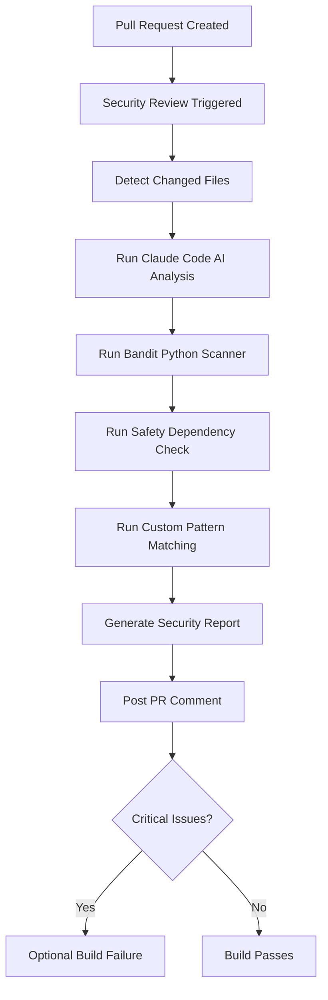

# Claude Code Security Review Setup Guide

## Overview

The Claude Code Security Review is an automated security analysis system that runs on every pull request. It combines AI-powered code analysis with traditional security scanning tools to identify vulnerabilities before they reach production.

## Features

### 🤖 AI-Powered Analysis
- **Claude Code Integration**: Advanced AI reviews code for subtle security issues
- **OWASP Top 10 Detection**: Comprehensive coverage of common web vulnerabilities
- **Context-Aware Analysis**: Understands code intent and architecture
- **False Positive Reduction**: Smart analysis reduces noise from conventional scanners

### 🔍 Multi-Layer Security Scanning
1. **Claude Code AI Review**: Deep semantic analysis of code changes
2. **Bandit**: Python security linter for common vulnerabilities
3. **Safety**: Dependency vulnerability scanner
4. **Custom Pattern Matching**: Project-specific security rules
5. **Manual Checks**: Regex-based detection for hardcoded secrets

### 📊 Comprehensive Reporting
- Pull request comments with actionable findings
- GitHub Actions artifacts for detailed reports
- Build annotations for critical issues
- Job summaries with vulnerability counts
- SARIF output for GitHub Security tab (planned)

## Setup Instructions

### 1. Add Anthropic API Key to GitHub Secrets

**Required for AI-powered security review**

1. Get your Anthropic API key from https://console.anthropic.com/
2. Go to your GitHub repository → Settings → Secrets and variables → Actions
3. Click "New repository secret"
4. Name: `ANTHROPIC_API_KEY`
5. Value: Your Anthropic API key
6. Click "Add secret"

**Security Note**: Never commit API keys to your repository. Always use GitHub Secrets.

### 2. Configure Security Review Rules

Edit `.github/security-review-config.yml` to customize:

```yaml
# Set fail_build to true to block PRs with critical issues
severity:
  critical:
    fail_build: false  # Change to true for strict enforcement
    notify: true
```

**Common Configuration Options:**

```yaml
# Exclude test files from review
review:
  exclude:
    - "**/test_*.py"
    - "**/*.test.js"

# Add custom security patterns
tools:
  custom_patterns:
    patterns:
      your_pattern:
        - pattern: "your_regex_here"
          severity: critical
          message: "Your security message"

# Suppress false positives
false_positives:
  suppress:
    - file: "path/to/file.py"
      rule: "B101"
      reason: "Intentional use case"
```

### 3. Enable Workflow

The workflow is enabled by default and will run on:
- **Pull Requests**: Automatically on PRs to `main` or `develop` branches
- **Manual Trigger**: From GitHub Actions tab → "Claude Code Security Review"

No additional configuration needed - just create a PR!

## How It Works

### Automated PR Review Flow



### Security Review Steps

1. **File Detection**: Identifies changed Python, JavaScript, TypeScript, and HTML files
2. **AI Analysis**: Claude Code reviews each file for security vulnerabilities
3. **Static Analysis**: Bandit scans Python code for common security issues
4. **Dependency Check**: Safety checks for known vulnerabilities in dependencies
5. **Pattern Matching**: Custom regex patterns detect hardcoded secrets and dangerous functions
6. **Report Generation**: Consolidated report with severity ratings
7. **PR Notification**: Results posted as PR comment with actionable recommendations

## Understanding Security Findings

### Severity Levels

#### 🔴 CRITICAL
**Impact**: Immediate security risk, potential data breach or system compromise
**Action**: Must be fixed before merging
**Examples**:
- Hardcoded API keys or passwords
- SQL injection vulnerabilities
- Command injection via `eval()` or `os.system()`
- Insecure deserialization with `pickle`

#### 🟡 MEDIUM
**Impact**: Potential security weakness that could be exploited
**Action**: Should be fixed soon, may merge with documented risk
**Examples**:
- Missing input validation
- Insecure random number generation
- Potential path traversal
- Insufficient logging of security events

#### 🟢 LOW
**Impact**: Security best practice violation, minimal immediate risk
**Action**: Consider fixing in future refactoring
**Examples**:
- Use of `assert` in production code
- Missing security headers
- Verbose error messages

### Example Security Finding

```markdown
### 🔴 CRITICAL
**File**: `backend/services/email_processor.py:45`
**Issue**: Hardcoded API key detected
**Risk**: API key exposure could lead to unauthorized access and data breaches

**Code**:
```python
ANTHROPIC_API_KEY = "sk-ant-1234567890abcdef"  # SECURITY RISK!
```

**Fix**:
```python
import os
ANTHROPIC_API_KEY = os.environ.get('ANTHROPIC_API_KEY')
if not ANTHROPIC_API_KEY:
    raise ValueError("ANTHROPIC_API_KEY environment variable not set")
```
```

## Common Security Issues & Fixes

### 1. Hardcoded Secrets

❌ **Vulnerable**:
```python
api_key = "sk-ant-1234567890"
password = "mypassword123"
```

✅ **Secure**:
```python
import os
api_key = os.environ.get('ANTHROPIC_API_KEY')
password = os.environ.get('DB_PASSWORD')
```

### 2. SQL Injection

❌ **Vulnerable**:
```python
cursor.execute(f"SELECT * FROM users WHERE username = '{username}'")
```

✅ **Secure**:
```python
cursor.execute("SELECT * FROM users WHERE username = %s", (username,))
```

### 3. Command Injection

❌ **Vulnerable**:
```python
os.system(f"ls {user_input}")
```

✅ **Secure**:
```python
import subprocess
subprocess.run(['ls', user_input], check=True)
```

### 4. Path Traversal

❌ **Vulnerable**:
```python
with open(f"data/{filename}", 'r') as f:
    content = f.read()
```

✅ **Secure**:
```python
import os
safe_path = os.path.join('data', os.path.basename(filename))
if not safe_path.startswith('data/'):
    raise ValueError("Invalid file path")
with open(safe_path, 'r') as f:
    content = f.read()
```

### 5. Insecure Deserialization

❌ **Vulnerable**:
```python
import pickle
data = pickle.loads(user_data)  # Can execute arbitrary code!
```

✅ **Secure**:
```python
import json
data = json.loads(user_data)  # Safe deserialization
```

## Workflow Customization

### Run Review on All Files

```yaml
# In GitHub Actions UI, when manually triggering
workflow_dispatch:
  inputs:
    review_scope: "all_files"  # Instead of "changed_files"
```

### Adjust Review Scope

Edit `.github/workflows/security-review.yml`:

```yaml
# Add more file types to review
paths:
  - '**.py'
  - '**.js'
  - '**.go'    # Add Go files
  - '**.java'  # Add Java files
```

### Block PRs with Critical Issues

Edit `.github/security-review-config.yml`:

```yaml
severity:
  critical:
    fail_build: true  # Change from false to true
```

## Troubleshooting

### Issue: "ANTHROPIC_API_KEY not found"

**Solution**: Verify the secret is added to GitHub repository settings:
```bash
# Test from GitHub Actions
echo ${{ secrets.ANTHROPIC_API_KEY }} | cut -c1-10
```

### Issue: "Claude Code CLI not installed"

**Solution**: The workflow automatically installs Claude Code. If it fails:
1. Check the workflow logs for npm installation errors
2. Verify Node.js is available in the runner
3. Try installing manually in the workflow

### Issue: "Too many files to review"

**Solution**: Limit review scope:
```yaml
# In .github/security-review-config.yml
review:
  exclude:
    - "**/migrations/**"
    - "**/tests/**"
    - "**/fixtures/**"
```

### Issue: "False positive detections"

**Solution**: Suppress specific warnings:
```yaml
# In .github/security-review-config.yml
false_positives:
  suppress:
    - file: "tests/test_security.py"
      rule: "B101"
      reason: "Assert used intentionally in tests"
```

## Best Practices

### 1. Review Security Findings Promptly
- Address critical issues immediately
- Document why medium/low issues are deferred
- Don't dismiss warnings without investigation

### 2. Keep Configuration Updated
- Regularly review `.github/security-review-config.yml`
- Add new patterns as threats evolve
- Remove obsolete rules

### 3. Educate Your Team
- Share security findings in team meetings
- Create internal documentation for common fixes
- Celebrate security improvements

### 4. Monitor Security Trends
- Review security report artifacts monthly
- Track reduction in vulnerability counts
- Identify recurring patterns for training

### 5. Integrate with Development Workflow
- Run security review on feature branches early
- Don't wait until PR review to find issues
- Use local security linters before pushing

## Local Security Testing

Before pushing code, run local security checks:

```bash
# Install security tools
pip install bandit safety

# Run Bandit
bandit -r . -f screen

# Check dependencies
safety check

# Check for secrets (using git-secrets or similar)
git secrets --scan
```

## Resources

### Documentation
- [OWASP Top 10](https://owasp.org/www-project-top-ten/)
- [Python Security](https://docs.python.org/3/library/security.html)
- [Bandit Docs](https://bandit.readthedocs.io/)
- [Safety Docs](https://pyup.io/safety/)

### Claude Code
- [Claude Code Documentation](https://docs.anthropic.com/claude/docs)
- [Claude API Reference](https://docs.anthropic.com/claude/reference)

### GitHub Security
- [GitHub Security Features](https://docs.github.com/en/code-security)
- [Secret Scanning](https://docs.github.com/en/code-security/secret-scanning)
- [Dependabot](https://docs.github.com/en/code-security/dependabot)

## Support

For issues with the security review workflow:
1. Check this documentation
2. Review workflow logs in GitHub Actions
3. Create an issue in the repository
4. Contact the security team

---

**Remember**: Security is everyone's responsibility. This automated review is a tool to help, but it doesn't replace security awareness and secure coding practices.
